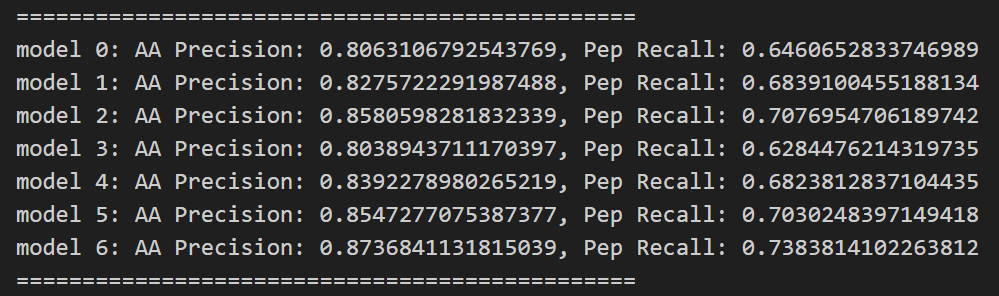

# RankNovo

**The official code for 'Universal Biological Sequence Reranking for Improved De Novo Peptide Sequencing'**

## Setup Environment

You can directly use the [NAT Denovo](../NAT_denovo.md) environment if you have set up before.

```bash
conda create -n ranknovo python=3.10

conda activate ranknovo

pip install -r ./requirements.txt
```

## Testing Data

The model checkpoint is available at [here](https://drive.google.com/file/d/1Zfzpu5JHUvMXfvNPA-QVGzXMyF499vFL/view?usp=sharing).

After downloading the .ckpt file, put it under the ./ckpt folder

We prepare the MGF file and base model predictions for the bacillus species of 9-species-V1 test set.

Test MGF File: [bacillus_V1.mgf](https://drive.google.com/file/d/1CtmRpAHSK7uqi5q3KraCaLY7QSsFQhcR/view?usp=sharing)

Test Candidates File: [bacillus_6m_V1.pkl](https://drive.google.com/file/d/1_iERygz8wNEsOvLYv7CMDPhY7lr-JJ-A/view?usp=sharing)

After downloading the test data files, put them under the ./test_data folder

*bacillus_6m_V1.pkl* contains the base model predictions for all spectrums in *bacillus_V1.mgf*, each is a list containing 7 peptides, corresponding to True label, Casanovo-V1, ContraNovo, ByNovo, R-Casanovo, R-ContraNovo, R-ByNovo predictions.

## Run Evaluation

For users using slurm servers:

```bash
sbatch -N 1 --gres=gpu:1 -p <> -A <> run.sh
```

For other users, remove the 'srun' in the last line of run.sh, then run:

```bash
bash run.sh
```

To save predictions, set the value 'save' in RankNovo.config.yaml to True

## Results

the output should be like:



Where model 0~5 corresponds to Casanovo-V1, ContraNovo, ByNovo, R-Casanovo, R-ContraNovo and R-ByNovo respectively. Model 6 is RankNovo.

if the value 'save' in RankNovo.config.yaml is True, 8 peptides for each spectrum will be saved, corresponding to True label, Casanovo-V1, ContraNovo, ByNovo, R-Casanovo, R-ContraNovo, R-ByNovo predictions and RankNovo prediction respectively.
